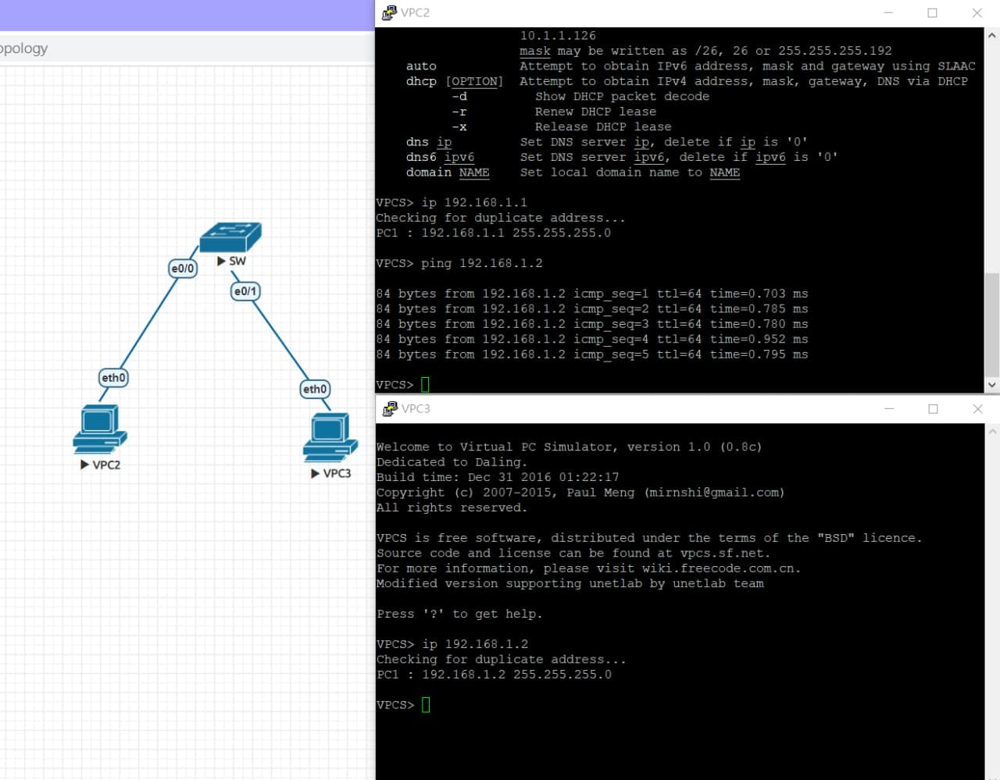

# 20210914 課堂筆記
## 課程所使用的工具
### [EVE-NG](https://www.eve-ng.net/)
這是一款網路模擬器，透過 Web Browser 建立 Lab，不用安裝 Client，介面也很親民容易使用。
### [VMware](https://www.vmware.com/tw/products/workstation-player/workstation-player-evaluation.html)
業界中用來建構雲端基礎架構的一流虛擬化平台。本課程使用 VMware 作為 Host，在其部署 EVE Server。
### PuTTY
這是一款整合虛擬終端、系統控制台和網路檔案傳輸為一體的自由及開放原始碼的程式。
## cisco 設備的一些操作指令小知識
* 如果要查詢指令，進入「特權模式#」後，使用 show 指令...
* 在打指令時，可不用全部的指令，只要指令長度可以識別就可以了
>> show interface ethernet0/0 等同於 sh int e0/0
>> configure terminal 等同於 conf t (設定模式)
* 如果要在設定模式下查詢資料，指令前要加上一個 do
>> do show int e0/0
* 如果打指令太長怕打錯或怕麻煩，只要指令長度可以識別，可以使用「tab鍵」補完
>> no auto (按下tab鍵後結果如下↓)
>> no auto-summary
* ctrl+A 可以把游標跳到最前頭
* 在cisco下，ping 指令要在特權模式下執行，如果成功，會用 ! 表示
* 路由器(router)可以切割廣播區域
## 本日實作
拉1個 SW 跟2個 VPC 出來後，設定好2個 VPC 的 IP 後互 Ping

## 參考資料
https://www.jannet.hk/eve-ng-zh-hant/