# 20210928 課程筆記
## 實作一
### 設定 VPC IP
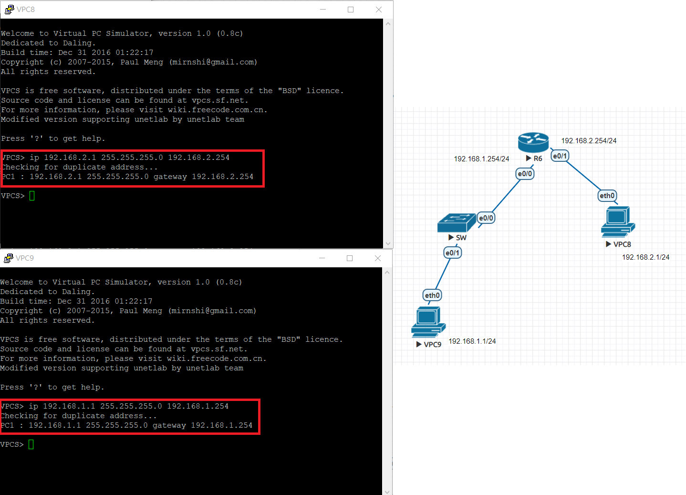
### 設定 Router
```
R6#conf t
R6(config)#int e0/0
R6(config-if)#ip addr 192.168.1.254 255.255.255.0
R6(config-if)#no shut
R6(config-if)#int e0/1
R6(config-if)#ip addr 192.168.2.254 255.255.255.0
R6(config-if)#no shut
```
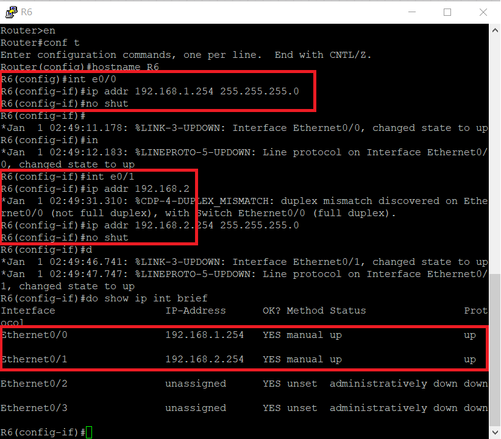
### 2台 VPC 互 Ping
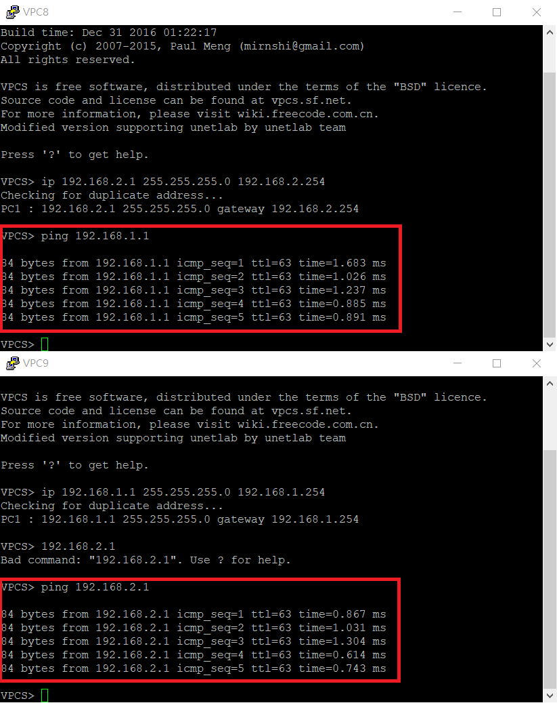
## 實作二 DHCP Server
### 設定 Router
* 建立位址儲備池
```
R6(config-if)#ip dhcp pool mypool1
```
* 指定分配的IP範圍
```
R6(dhcp-config)#network 192.168.1.0 255.255.255.0
```
* 設定預設閘道
```
R6(dhcp-config)#default-router 192.168.1.254 
```
* 設定DNS
```
R6(dhcp-config)#dns-server 8.8.8.8      
```
* 回到全域模式
```
R6(dhcp-config)#exit        
```
* 指定 192.168.1.250 ~ 192.168.1.254 不配發
```
R6(config)#ip dhcp excluded-address 192.168.1.250 192.168.1.254
```
* e0/1接口之設定同理

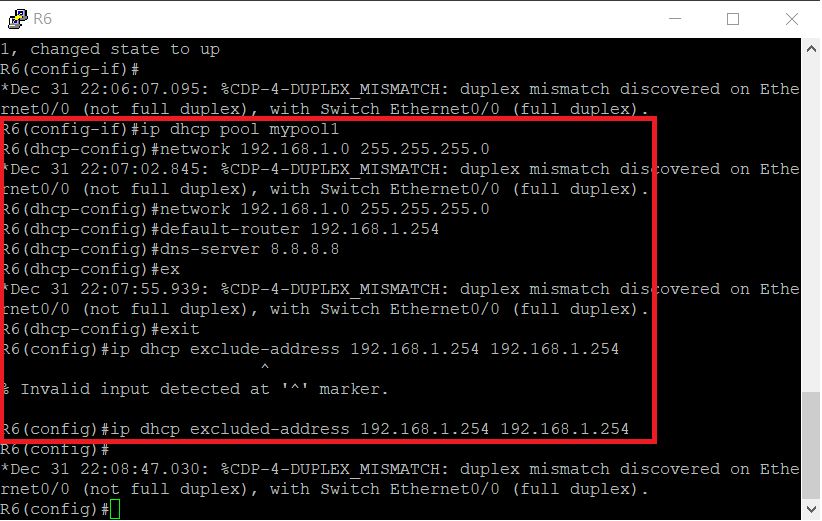
### 設定 VPC
* 用指令 clear ip 清掉原本的 IP
* 輸入指令 ip dhcp 來使用 DHCP
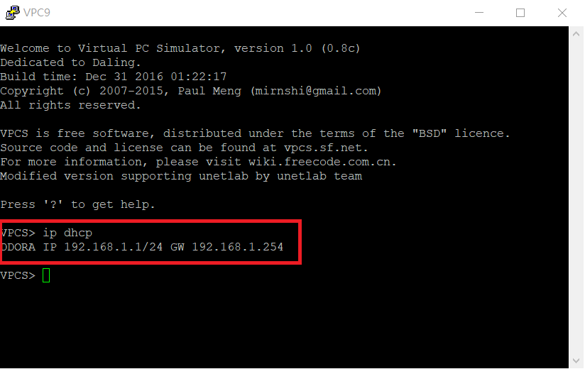
* 輸入指令 show ip 進行確認
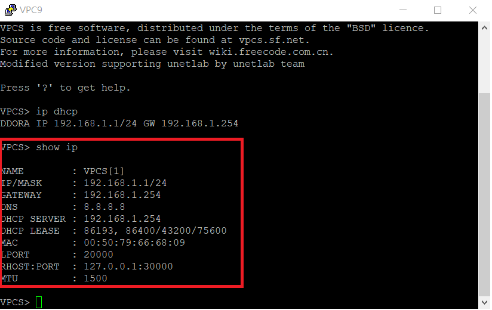
* 另一台 VPC 設定同理
* 由於使用的是 Professional 版本，所以可以在動態的環境之下新增主機並進行設定
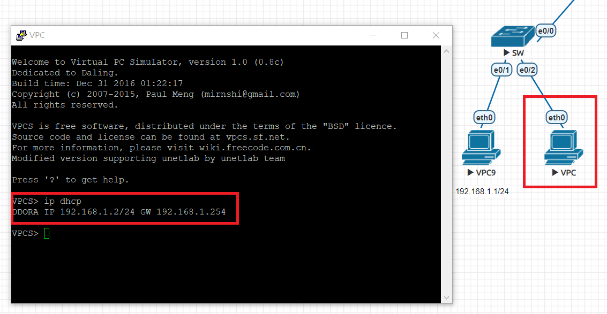
### 新增 Network
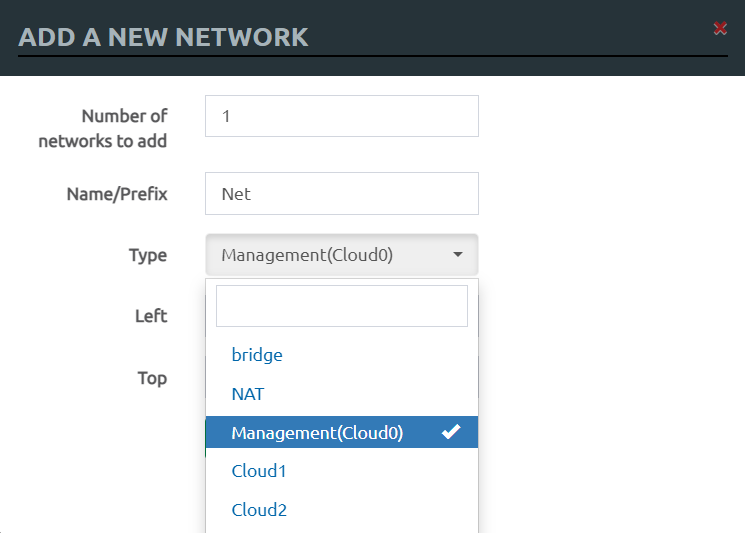
### 在 Router 的 e0/2 接口使用 DHCP 自動取得 IP
```
R6(config)#int e0/2
R6(config-if)#ip addr dhcp
R6(config-if)#no shut
```
* 輸入指令 do show ip int brief 確認狀態
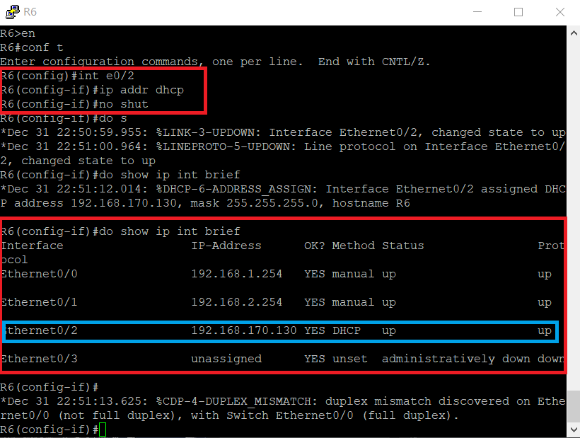
### 測試虛擬機能不能 Ping 到右方的界面
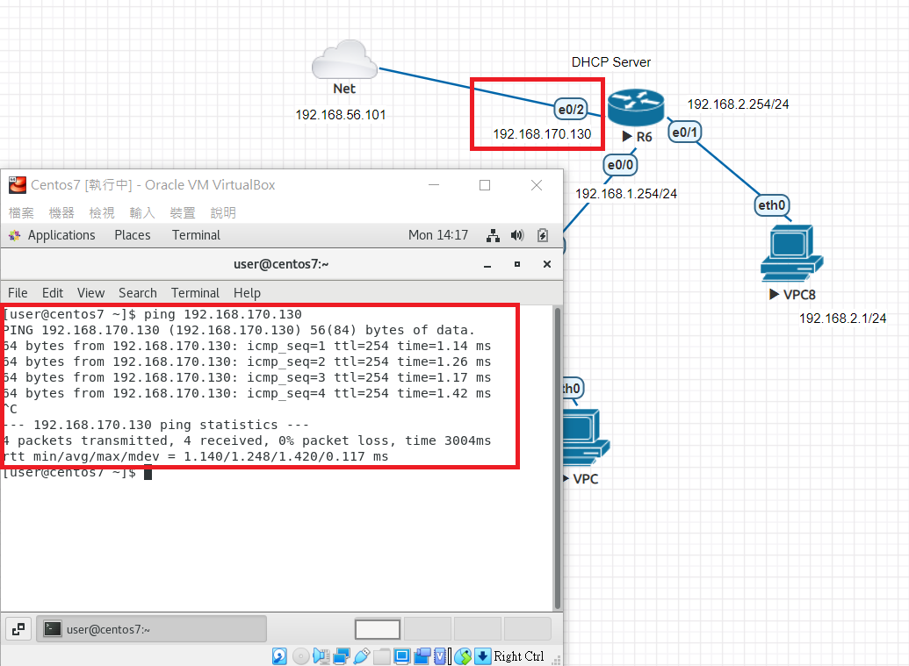
## 實作三 設定 SSH
### Password 跟 Secret 的差別
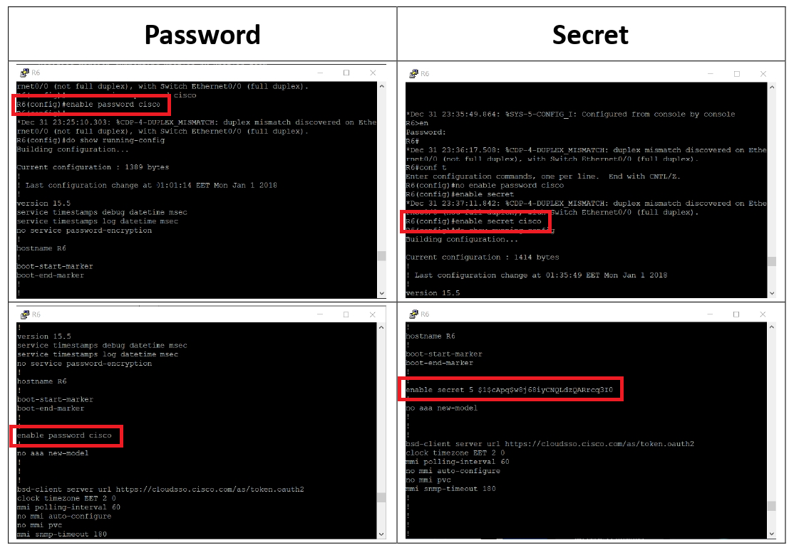
### 設定本機帳號
* 建立 帳號cisco 密碼cisco (密碼未加密)
```
R6(config)#username cisco password cisco
```
* 建立 帳號cisco 密碼cisco (密碼加密)
```
R6(config)#username cisco secret cisco
```
### 設定加密方式
*  設定 domain-name 為 test
```
R6(config)#ip domain-name test.com
```
* 產生 rsa金鑰
```
R6(config)#crypto key generate rsa
```
* 使用 1024bit 加密 (預設512)
```
How many bit in the modulus[512]:1024
```
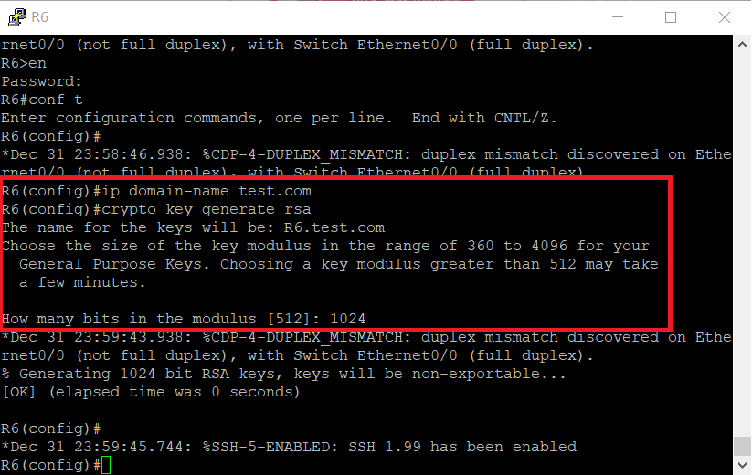
### 啟用 SSH
* 使用 SSH V2 協定
```
R6(config)#ip ssh version 2
```
* 開啟 0~4vty 連線 (即最大連線人數5人)
```
R6(config)#line vty 0 4
```
* 啟用 密碼(login) 及 帳號(local)
```
R6(config-line)#login local
```
* 啟用 SSH
```
R6(config-line)#transport input ssh
```
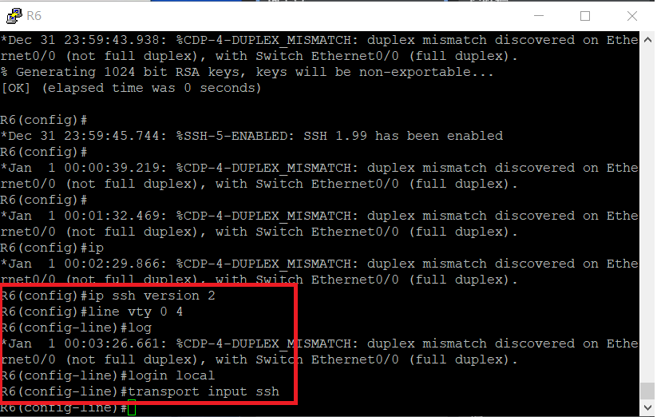
### 使用虛擬機進行連線測試
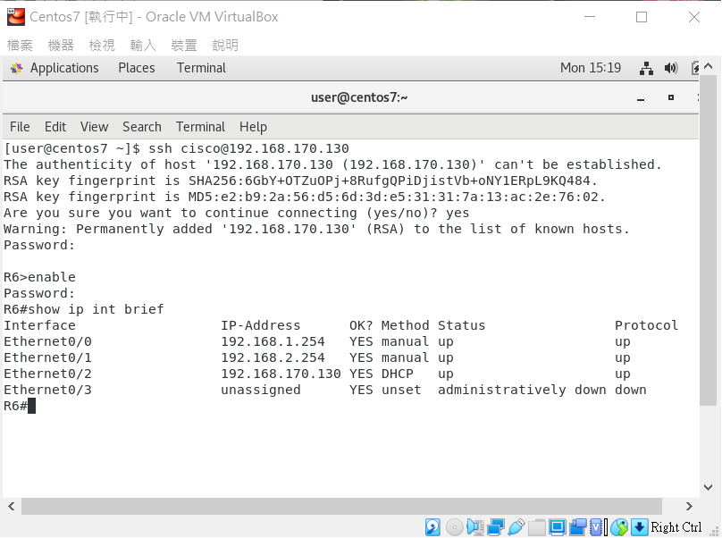
## 參考資料
[Cisco_DHCP_Server實做](https://david50.pixnet.net/blog/post/45220440-%5B%E7%AD%86%E8%A8%98%5Dcisco-dhcp-server%E5%AF%A6%E5%81%9A)

[Cisco基本指令-啟用SSH](https://david50.pixnet.net/blog/post/45217866-%5B%E7%AD%86%E8%A8%98%5Dcisco%E5%9F%BA%E6%9C%AC%E6%8C%87%E4%BB%A4-%E5%95%9F%E7%94%A8ssh)