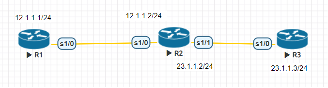
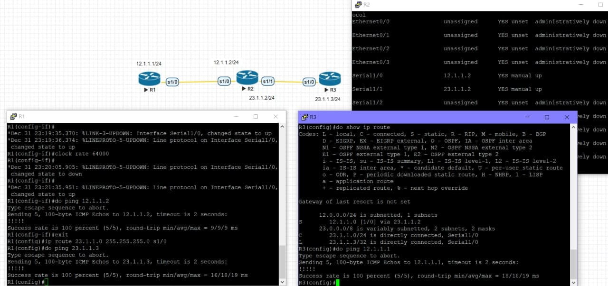
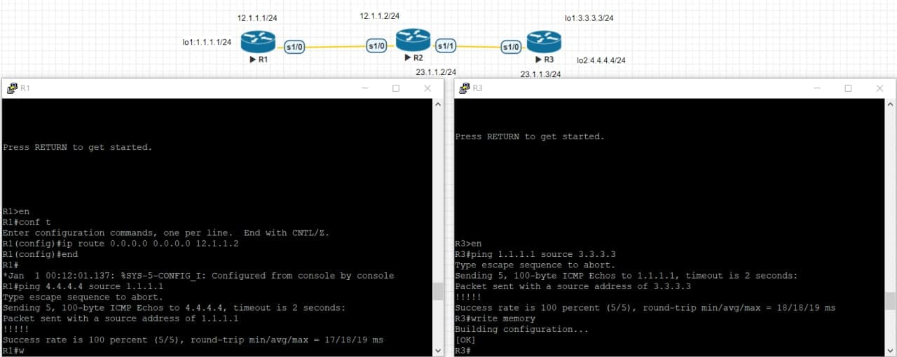

# 20211005 課程筆記
## 課堂補充資料
### [Cisco Router設定檔備份與還原(使用TFTP)](http://yearlin101.blogspot.com/2017/08/cisco-routertftp.html)
### [CentOS7-檔案傳輸界的隱形冠軍-TFTP伺服器](http://blog.itist.tw/2016/09/install-a-tftp-server-on-centos-7.html)
## 配置序列埠

```
R1#conf t
R1(config)#int s1/0
R1(config-if)#ip addr 12.1.1.1 255.255.255.0
R1(config-if)#no shut
R1(config-if)#clock rate 64000
```
其他 router 設定同上
## 設置靜態路由
為了讓 R1 跟 R3 可以互通，需要進行以下設定
### R1
```
R1(config)#ip route 23.1.1.0 255.255.255.0 s1/0 (自己的出口)
R1(config)#ip route 23.1.1.0 255.255.255.0 12.1.1.2 (下一跳)
```
### R3
```
R3(config)#ip route 12.1.1.0 255.255.255.0 s1/0 (自己的出口)
R3(config)#ip route 12.1.1.0 255.255.255.0 23.1.1.2 (下一跳)
```
「自己的出口」及「下一跳」這兩種方法擇一即可
### 測試結果

## 設置默認路由
### R1
```
R1(config)#ip route 0.0.0.0 0.0.0.0 12.1.1.2
```
### R2
```
R2(config)#ip route 0.0.0.0 0.0.0.0 s1/1
```
### 測試結果
