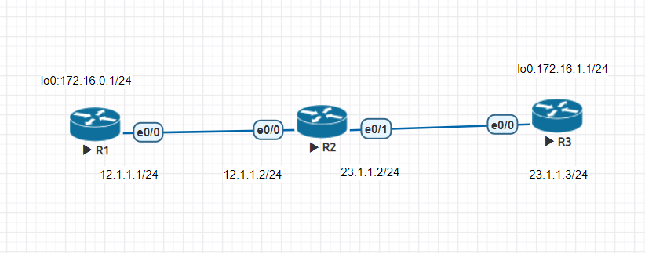

# 20211019 課程筆記
## 課堂實作

### RIP設定
```
R1(config)#router rip
R1(config-router)#version 2
R1(config-router)#network 12.1.1.0
```
輸入 show ip route 來查看路由

### RIP自動彙總—連續網路的合併

欲要取消自動彙總，要在設定加上 no auto-summary
```
R1(config)#router rip
R1(config-router)#version 2
R1(config-router)#network 12.1.1.0
R1(config-router)#network 172.16.0.0
R1(config-router)#no auto-summary
```
