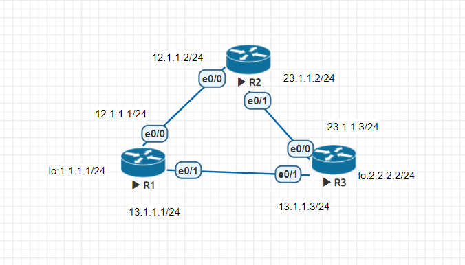
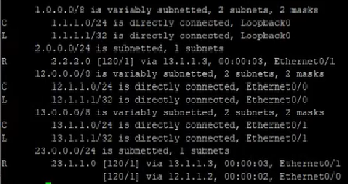
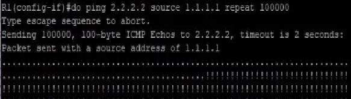
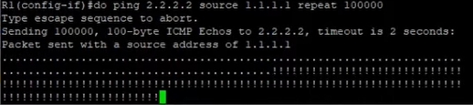
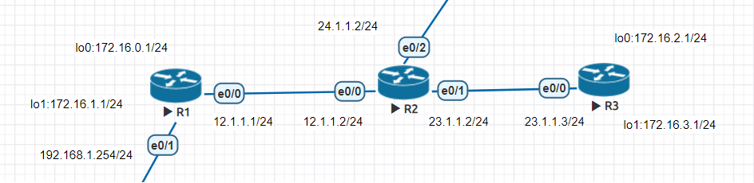
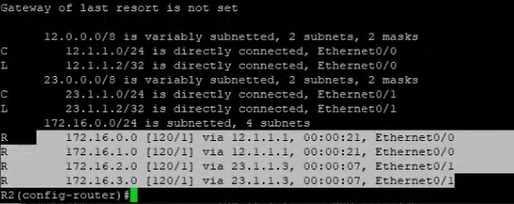
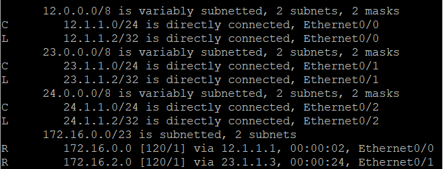

# 20211026 課程筆記
## 課堂實作一

### 使用RIP動態路由協議
設定好RIP後，輸入 show ip route 確認路由



模擬 R1 e0/1 斷線
```
R1(config)#int e0/0
R1(config-if)#shut
R1(config-if)#do ping 2.2.2.2 source 1.1.1.1 repeat 100000
```


因為是使用RIP動態路由協議，所以需要2~3分鐘的時間才能連線
接下來介紹的EIGRP路由協議則快速許多
### 使用EIGRP路由協議
```
R1(config)#router eigrp 1
R1(config-router)#network 12.1.1.0 0.0.0.255
R1(config-router)#network 13.1.1.0 0.0.0.255
R1(config-router)#network 1.1.1.0 0.0.0.255
```
模擬 R1 e0/1 斷線


## 課堂實作二


將 172.16.0.0~172.16.3.0 四個路由條目進行手動彙整


```
R1(config)#router rip
R1(config-router)#version 2
R1(config-router)#network 12.1.1.0
R1(config-router)#network 172.16.0.0
R1(config-router)#network 172.16.1.0
R1(config-router)#no auto-summary
R1(config-router)#int e0/0
R1(config-if)#ip summary-address rip 172.16.0.0 255.255.254.0
```
R3設定同理
### 結果
