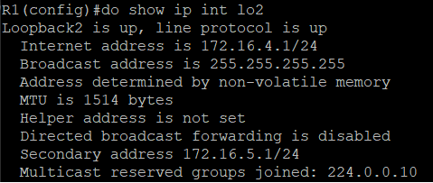

# 20211102 課程筆記

## 課堂實作一
### EIGRP的設置
```
R1(config)#router eigrp 10
R1(config-router)#network 12.1.1.0 0.0.0.255
```
輸入 show ip eigrp neighbors 確認鄰居表


輸入 show ip eigrp topology 確認拓樸表


## 課堂實作二
### 在同個介面設置2個IP
```
R1(config)#int lo2
R1(config-if)#ip addr 172.16.4.1 255.255.255.0
R1(config-if)#ip addr 172.16.5.1 255.255.255.0 secondary
```
輸入 show ip int brief 無法看到 172.16.5.1


輸入 show ip int lo2 才能進行確認


### 合併IP
設置EIGRP
```
R1(config)#router eigrp 10
R1(config-router)#network 172.16.4.0 0.0.0.255
R1(config-router)#network 172.16.5.0 0.0.0.255
```
合併指令之結構
```
ip summary-address eigrp [as] [合併完位址] [255.255.254.0]
```
```
R1(config)#int e0/0
R1(config-if)#ip summary-address eigrp 10 172.16.4.0 255.255.254.0
```
輸入 show ip route 進行確認


ping 172.16.4.1 及 172.16.5.1 確認結果

